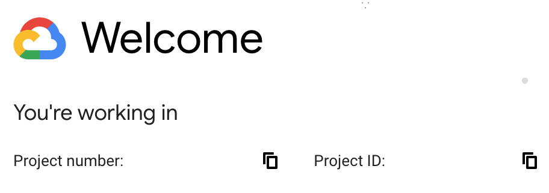

## Abstract

Google Cloud offers developers thousands of free and public machine images.
However, developers still need to create custom image for specified cases.
Although there are already guidelines from GCP and Packer,
none of them point out mistakes that can cause hours of debugging.
Thus, this article will help you set up the correct workflow and avoid them.

## Introduction

### Google Cloud Platform

GCP is one of the largest cloud platforms in the world.
Compute Engine is one of the mainstream services provided.
By registering trial, you will get free `$300` for 1 year usage.
Moreover, Cloud Build gives free `120 min/day` (machine type `n1-standard-1`).

### Packer by HashiCorp

Packer use your cloud compute engine to help you create a machine image.
It also has supports for Amazon Web Service, Azure and many more.

## Requirements

- A billing linked GCP project
- A Git repository contains your source code
- To install [gcloud](
  https://cloud.google.com/sdk/docs/install
  ) or launch [Cloud Shell](
  https://cloud.google.com/shell/docs/launching-cloud-shell
  )

## Steps

### Enable required APIs

1. Browse to [Google Cloud Console](https://console.cloud.google.com/)
1. Obtains Project ID
   
1. From `Navigation Menu` -> `APIs & Services` -> `Enabled APIs & Services`.
1. Click button `ENABLE APIS AND SERVICES`.
1. Search for these APIs and enable all of them:
   - Cloud Build API
   - Compute Engine API
   - Service Management API
   - Google Cloud Storage JSON API

### Grant IAM permissions for Cloud Build principal

1. From the `Navigation Menu` -> `IAM & Admin` -> `IAM`.
1. Edit the existed principal `<random-number>@cloudbuild.gserviceaccount.com`
1. Add these roles:
   - Cloud Build Service Account (already added by default)
   - Compute Admin
   - Service Account User

### Build `packer` container image

1. Clone packer project

    ```bash
    git clone https://github.com/GoogleCloudPlatform/cloud-builders-community.git
    ```

1. Cd into packer

    ```bash
    cd cloud-builders-community/packer
    ```

1. Build and publish to `gcr.io`

    ```bash
    gcloud builds submit .
    ```

Wait a few second and press `y` when prompt appears

### Add packer configurations

At the root of your repository, add these files:

#### **`cloudbuild.yaml`**

```yaml
steps:
  - name: "gcr.io/<your-project-id>/packer"
    args:
      - build
      - packer.json
```

#### **`packer.json`**

```json
{
  "builders": [
    {
      "type": "googlecompute",
      "project_id": "<your-project-id>",
      "zone": "us-central1-a",
      "image_storage_locations": ["us-central1"],
      "ssh_username": "packer",
      "source_image_family": "debian-11",
    }
  ],
  "provisioners": [
    {
      "type": "shell",
      "inline": "echo 'Hello World!'"
    }
  ]
}
```

### Setup Cloud Build Trigger

1. From the `Navigation Menu` -> `Cloud Build` -> `Triggers`.
1. Click button `+ Create Trigger`.
1. Input these values:
   - Name: `<your-trigger-name>`
   - Event: `Push to a branch`
   - Source: Connect to your Git repository
   - Configuration: `Autodetected`
   - Location: `Repository`
   - Cloud Build configuration file location: `cloudbuild.yaml`
   - Service account: Leave empty
1. Click button `Create`

### Run Trigger

1. Click button `RUN` from triggers list.
1. From the `Navigation Menu` -> `Cloud Build` -> `History`.
1. Wait for build.

## Results

From the `Navigation Menu` -> `Compute Engine` -> `STORAGE` -> `Images`.
An image named `packer-<timestamp>` is created.

## Troubleshooting FAQ

```bash
Failed to trigger build: generic::invalid_argument: generic::invalid_argument:
if 'build.service_account' is specified, the build must either
(a) specify 'build.logs_bucket'
(b) use the CLOUD_LOGGING_ONLY logging option,
or (c) use the NONE logging option
```

Solution: Leave the service account empty when creating Cloud Build Trigger.

```bash
Error waiting for SSH:
Packer experienced an authentication error when trying to connect via SSH.
This can happen if your username/password are wrong.
You may want to double-check your credentials as part of your debugging process.
original error: ssh: handshake failed: ssh: unable to authenticate,
attempted methods [none publickey], no supported methods remain
```

Solution: Try changing source image. Ex: change from Ubuntu to Debian.

## References

- [Building VM images using Packer](
  https://cloud.google.com/build/docs/building/build-vm-images-with-packer
  )
- [Google Compute Builder](
  https://www.packer.io/plugins/builders/googlecompute
  )
- [Community-contributed images for Google Cloud Build](
  https://github.com/GoogleCloudPlatform/cloud-builders-community
  )
